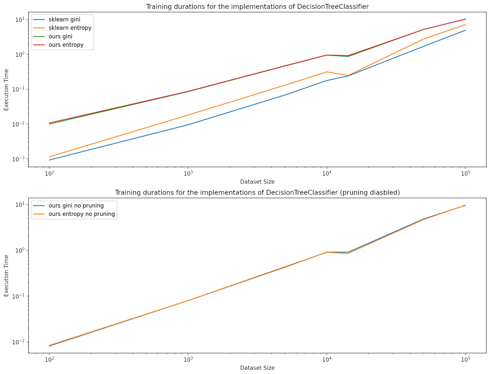
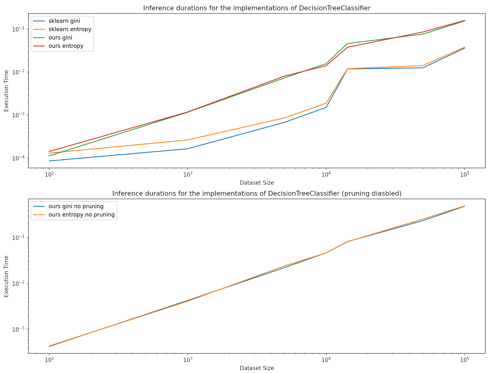

# Repport on impementing a decision tree classifier

In this assignement I designed, coded and evaluated a decision tree classifier in this report we'll take a look at the design decisions and we'll discusse the preformance of the implementation.

## Content of the archive

```sh
- benchmark.ipynb  # a notebook that contains the code evaluating the model
- decision_tree.py # the source file of everything directly related to the implementation of DecisionTree
- doc       # the sources of the report 
- scratch.ipynb    # a notebook containing experiments and snipets of code used during the conception
- utils.py         # the source file containing everything used in the implementation that is not directly part of the implementation
```

## Designing and coding the decision tree

### Guiding ideas

Here are some of the general ideas I wanted to follow designing the decesion tree : 

#### Python is slow but... 

Python is slow. That being said it was still my choice to implement the tree because:
- it's simple
- it has a good datascience community
- numpy's `ndarray` negate part of the slowness of python 
- rust wasn't one of the available language 

#### Prioritize numpy

Numpy, being implmented in c, allows us to get good performances when manipulating a large amount of data. 
So we are gonna to try to prioritize the use of numpy even if it can complexify the code

```py
ndarray = np.arange(20000000)
l = list(ndarray)
l = [2*x for x in l] # 2.5 seconds
ndarray = ndarray*2  # 0.9 seconds
# 3.9 seconds
lb = []
for i in l:
    lb.append(i*2)
```

#### Tree = Recursive

Obviously when we talk about tree the first thought is **recursion**. So  we'll use a recursive algorythm both for fitting the classifier and for the prediction. That being said repeated function call can be costly so we'll try to limit ourselve to one traversal.

### Design

Now I'll explain how we build the tree and then exploit it.

#### The tree 

Let's take a look at how tree is composed. 

- `DecisionTree` the wrapper class that is used by the end user. 
- `Node` an abstract class that describe a node of the decsion tree
- `Leaf` the leaf node of the tree containing :
  - `label` : the majority label for the leaf
- `Branch` the branch node of the tree containing :
  - `feature` : the index of the feature allong which the split has been done
  - `boundry` : the decision boundry of the split
  - `sup_branch:Node` & `inf_branch:Node` : the child node of the subtree
  - `_majority_label` : the majority label of the branch during training

#### Builading the tree

Most of the code that build the tree is contained in the recursive function `DecisionTree._build_tree`.

We first take care of the first two trivial case : a uniform `y` and a uniform `x` and we create an apropriate list.

```py
if np.all(y == y[0]):
    # If every y are equal return a leaf
    return Leaf(y[0])
elif np.all(x == x[0]):
    # If every x are equal then we return a leaf with the most common label
    count = ut.count_vals(y)
    return Leaf(ut.dict_max(count)[0])
```

If we're not in a trivial case it means we must create a split. To do so we will do a search of the best feature to split in terms of information gain.

```py
else:
    # Infos about the best split found
    best_IG = 0
    best_feature = None
    best_split = None

    y_cached_split = [] # We can cache some of the work we already did
    cached_mask = None  # trying to find the best split
    
    # Useful stuff to compute IG but doesnt change between features
    E_base = self.impurity_mesurement(y)
    n = len(y)

    for feat in range(x.shape[1]):
        # We split our classes along the mean of the feature 
        split_plane = x[:, feat].mean()
        split_mask = x[:, feat] < split_plane
        ysubset1 = y[split_mask]
        ysubset2 = y[np.logical_not(split_mask)]

        # We compute the information gain for that feature
        E_s1 = self.impurity_mesurement(ysubset1)
        E_s2 = self.impurity_mesurement(ysubset2)
        E_s = (E_s1 * len(ysubset1) + E_s2 * len(ysubset2))/ n
        IG_s = E_base - E_s

        # If it is better than the previous IG save the split
        if IG_s >= best_IG:
            best_IG = IG_s
            best_feature = feat
            best_split = split_plane
            y_cached_split = [ysubset1, ysubset2]
            cached_mask = split_mask
    
    counts = ut.count_vals(y)
    majority_label = ut.dict_max(counts)[0] 

    return Branch(
        best_feature, 
        best_split, 
        inf_branch=self._build_tree(x[cached_mask], y_cached_split[0]), 
        sup_branch=self._build_tree(x[~cached_mask], y_cached_split[1]),
        majority_label=majority_label
    )
```

You can note that we keep some of the computed values cached so that we dont need to computeit again for the next call of the recursion.

We also store the majority label for the branch during training because it will be usefull for the 

#### Pruning 

The implementation of the pruning algorythm is spread accross the iteration implementations of the fucntion `Node.prune`.

The function prune return the prune self and the number of positive hits achieved by the pruned tree on the prunning dataset. We do not use the accuracy because for our purpose it's equivalent to the number of positive hits. It's also easier to reuse the number of hit for the parent tree.

$$
accuracy_1 < accuracy_2 \\
\lrArr {positives_1 \over N} < {positives_2 \over N} \\
\lrArr positives_1 < positives_2
$$

Appart from that no quirks in the implementation we just follow the algorythm described in the subject

#### Inferance 

We just propagate the dataset in the tree and return a label when a x reach a leaf. 

The only thing that gives a bit of difficulty is that we need to keep the correspondence between the xs and the ys during thet traversal of the tree. the problem is keeping the order is costly. So the solution we choosed is to add the index of the x and then once the x reach a leaf we return the index allong the y and only sort the list at the end of the prediction

## Testing the Decision tree

### Comparison 

We'll compare our tree to scikit learn `DecisionTreeClassifier`.
To make the comparaison fair we'll add no limitation to the tree and use the `cost_complexity_pruning_path` function to prune the tree.

### Accuracy

Here's the validation accuracy of our model against scikit learn's.

|         | scikit learn | our implmentation |
| :-----: | :----------: | :---------------: |
|  gini   |   0.808469   |     0.830342      |
| entropy |   0.806786   |      0.8682       |

We can see we get a slightly better accuracy which is probably due to the scikit learn implementation being more optimized for performance.

It also seems that we get better results with entropy.

> **Sidenote** : I tested different value for the size of the prunning dataset but as it didnt seem to have an impact that is different from noise so I didnt include it in the `benchmark.ipynb`. The test can be seen in `scratch.ipynb`
> 
> I also tested an other regularisation parameter that would require a branch to have a `base_accuracy - accuracy_pruned > alpha` to not be prunned but it showed a negative impact on validation accuracy no matter the value of alpha so the idea was scratch

### Training time

I compared my implementation and scikit-learn on execution time on several randomly generated dataset and on the real dataset.

Here is the result of the benchmarck :
|                     |   size | sklearn gini | sklearn entropy | sklearn gini no pruning | sklearn entropy no pruning |  ours gini | ours entropy | ours gini no pruning | ours entropy no pruning |
| :------------------ | -----: | -----------: | --------------: | ----------------------: | -------------------------: | ---------: | -----------: | -------------------: | ----------------------: |
| Random(100)         |    100 |   0.00188231 |      0.00237012 |             0.000958204 |                 0.00117183 | 0.00818944 |   0.00924611 |           0.00732923 |              0.00773478 |
| Random(1000)        |   1000 |    0.0162668 |       0.0276742 |               0.0075078 |                  0.0136621 |  0.0800889 |    0.0807607 |            0.0726871 |               0.0737305 |
| Random(5000)        |   5000 |     0.182204 |        0.263704 |               0.0879135 |                   0.129792 |   0.438149 |     0.438669 |             0.415644 |                0.409316 |
| Random(10000)       |  10000 |     0.386553 |        0.595262 |                0.181556 |                   0.288868 |   0.943503 |     0.925951 |             0.971766 |                 0.91452 |
| Real Dataset(14265) |  14265 |     0.429145 |        0.451046 |                0.212405 |                   0.220252 |   0.730407 |      0.73031 |             0.705866 |                0.689217 |
| Random(50000)       |  50000 |      3.19425 |         5.37834 |                 1.33131 |                     2.4803 |    5.25878 |      4.91015 |              4.65287 |                 4.90372 |
| Random(100000)      | 100000 |      9.10937 |         12.9082 |                 3.54817 |                    5.67214 |    9.48811 |      9.70544 |              8.64532 |                 8.82824 |

So that it is more readable we created graphs of the performance :




We can observe several intresting thing from that graph : 

Although sklearn seems to have a better implementation in terms of speed my implmentation seems to grow with the same profile as the scikit learn implemntation. Which mean they share the same big-O notation. Which from the look of the graph might be $O(e^n)$.

Another thing that is intresting to see is that how noisy is the dataset has a big impact on the run time. Which makes sense considering that the algorythm as less chance to stop with big leafs if the dataset is noisy.

### inferance time

I compared my implementation and scikit-learn on execution time on several randomly generated dataset and on the real dataset.

Here is the result of the benchmarck :

|                     |   size |   sklearn gini |   sklearn entropy |   sklearn gini no pruning |   sklearn entropy no pruning |   ours gini |   ours entropy |   ours gini no pruning |   ours entropy no pruning |
|:--------------------|-------:|---------------:|------------------:|--------------------------:|-----------------------------:|------------:|---------------:|-----------------------:|--------------------------:|
| Random(100)         |    100 |    7.08103e-05 |       0.000106573 |               6.55651e-05 |                  7.65324e-05 | 1.93119e-05 |    3.91006e-05 |            0.000410795 |               0.000438929 |
| Random(1000)        |   1000 |    0.000157833 |       0.000278234 |               0.000149727 |                  0.000172138 | 0.00103569  |    0.00121593  |            0.00489092  |               0.00386429  |
| Random(5000)        |   5000 |    0.000688553 |       0.000866652 |               0.000677586 |                  0.000767469 | 0.00661993  |    0.00602508  |            0.0219588   |               0.0221114   |
| Random(10000)       |  10000 |    0.00192523  |       0.00169325  |               0.00197673  |                  0.00166535  | 0.0139227   |    0.0138409   |            0.0443594   |               0.0443764   |
| Real Dataset(14265) |  14265 |    0.00789714  |       0.0079391   |               0.00783896  |                  0.00753736  | 0.035815    |    0.028239    |            0.061399    |               0.0691364   |
| Random(50000)       |  50000 |    0.0116825   |       0.0126395   |               0.0117512   |                  0.0124135   | 0.0755329   |    0.0725815   |            0.225704    |               0.226079    |
| Random(100000)      | 100000 |    0.0314751   |       0.0287361   |               0.0305243   |                  0.0318279   | 0.143312    |    0.14024     |            0.425203    |               0.421446    |

For the sake of readbility we created graph for the inferance time too




Here again we see the scikit learn implementation is faster than ours but we still are in the same class of algorythm.

What is odd is that the inference seems to be slower with real dataset. Which is surprising considering the tree should be smaller so quicker to traverse.

## Testing the selected model 

Since it was the best performing model on the validation model we picked my implementation with :
- 0.2 pruning size
- prunning enable
- entropy disorder mesurement

And we obtained a `0.874` accuracy on the training test set.